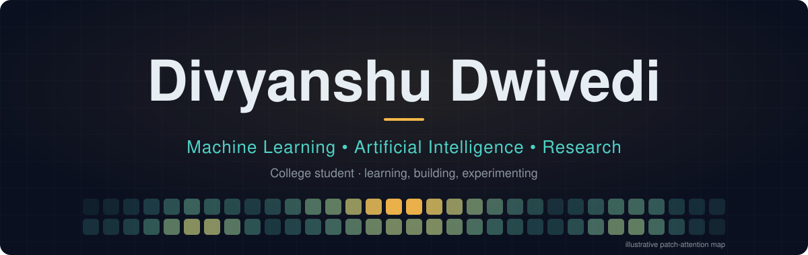
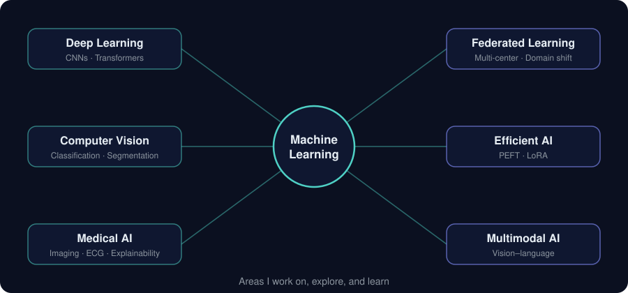

<div align="center">



[LinkedIn](https://www.linkedin.com/in/divyanshu-dwivedi-88564a33a) · [Email](mailto:divydwi@gmail.com) · [GitHub](https://github.com/DDVats)

</div>

## About

```yaml
name:      Divyanshu Dwivedi
status:    college student · learning, building, experimenting
focus:     [machine learning, artificial intelligence, deep learning, research]
vision:    [classification, segmentation, medical imaging, vision transformers]
exploring: [federated learning, PEFT / LoRA, explainable AI, multimodal models]
 
```

I'm a college student working in machine learning and AI, with a focus on deep learning and computer vision. I like to pair research-style questions with hands-on implementation.

## Focus



## What I'm exploring

| Area | What I'm looking at |
|---|---|
| **Federated learning** | Learning across medical imaging centers with domain shift and client heterogeneity |
| **Efficient adaptation** | PEFT and LoRA for adapting large pretrained models |
| **Explainable medical AI** | SHAP and Grad-CAM for interpreting model behaviour |
| **Vision models** | Vision Transformers and hybrid CNN/Transformer architectures |
| **ML data pipelines** | Data collection and information extraction for applied ML problems |
| **Multimodal learning** | Vision–language models |

<!--
FUTURE: uncomment and fill this section when a project becomes public.
Place it here, between "What I'm exploring" and "Tech stack".

## Selected work

| Project | What it is | Link |
|---|---|---|
| **Project name** | One line on the problem and approach | [Repository](https://github.com/DDVats/REPO-NAME) |
-->

## Tech stack

| | |
|---|---|
| **Languages** | `Python` `C++` `C` |
| **ML / DL** | `PyTorch` `TensorFlow` `Keras` `scikit-learn` `Hugging Face` |
| **Research tools** | `PEFT` `SHAP` `Grad-CAM` |
| **Data** | `NumPy` `Pandas` `Matplotlib` `Jupyter` |
| **Development** | `Git` `Linux` `Docker` `FastAPI` `Streamlit` |

## Contact

[LinkedIn](https://www.linkedin.com/in/divyanshu-dwivedi-88564a33a) · [Email](mailto:divydwi@gmail.com)

Happy to talk about ML research, projects, and learning.
